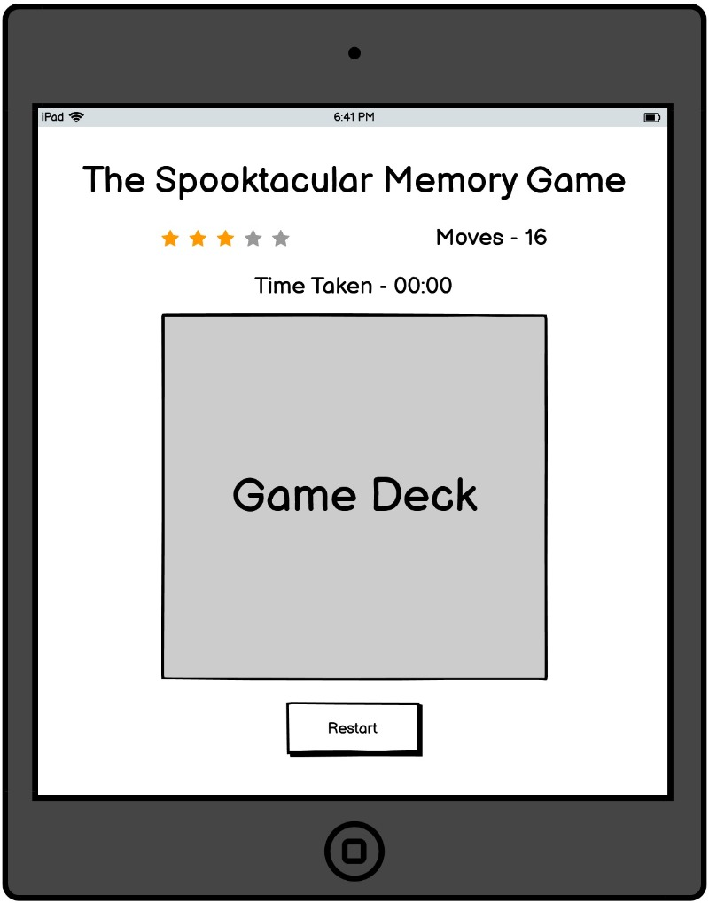

# Spooktacular Memory Game

[View the live project here](https://andywales83.github.io/Spooktacular-Memory-Game/)

---

## Contents

- [Project Description](#project-description)
- [UX Design](#ux-design)
- [Features](#features)
- [Technologies Used](#technologies-used)
- [Testing](#testing)
- [Deployment](#deployment)
- [Credits](#credits)

---

## Project Description

Spookacular Memory Game is a halloween themed memory card game, based on the classic card matching games. The game has been created, with the aim of allowing individuals a little lighthearted fun.

The game is based on a deck of 12 cards, which are laid face down on a surface and two cards are flipped face over on each turn. The object of the game is to turn over pairs of matching cards in the quickest time, in order to achieve the highest rating.

---
## UX Design

### User Stories
- #### First Time Visitor Goals

    1. As a first time visitor, i want to be presented with a cleanly presented introduction and game page.
    2. As a first time vistor, I would expect to see simple instruction to the game and clear navigation to the game page.
    3. As a first time visitor, I would expect to be able to see clear and easy to use functionality.

- #### Returning Visitor Goals

    1. As a returning visitor, I would expect to be able to keep a track of my score and time playing the game.
    2. As a returning visitor, I would expect to be able to see a possible increase in difficulty settings for the game.
    3. As a returning visitor, I may expect to be able to choose from differnt card faces and themes.

- #### Frequent user Goals

    1. As a frequent visitor, I would expect to be able to report issues with the game.
    2. As a frequent visitor, I would expect to be bale to see details of any up and coming game builds
    3. As a frequent visitor, I would expect to be able to find links to social media or ways to follow the content creator.

---
## Scope

### What a user may expect and how those expectations will be met

- To meet the expectations of user, the aim in build and design of the game, is to ensure that the individual is met with a clean and clear user interface from the start, that is striking to the eye, whilst remaining fun. The initial aceess to the game, should bring the user to a main page, that details the instructions for the game and allows for easy navigation to the game page thereafter, with links back and forth, clearly visible and easily accessible. The game screen will be clean in structure and free of any distracting clutter that will draw attention away from the game. 

- For returning users, the game itself will be built to incorporate a score panel, that will give users an indication of the number of moves made, the time taken as the game is being played and a "star" rating system, set against the number of clicks made. The aim in building, will also be to try and achieve a system, where future improvements, will allow the user to click on a number of buttons that may increase the difficulty, through addition of extra cards to the game screen, or an introduction of challenges. Along side the plans to incorporate additionan difficulties, is the idea of keeping the game feeling fresh and exciting, by incorporating the future introduction of additional themes, and giving the game a more generic UI overhaul, allowing the themes to be standalone. 

- For frequent users, the site could include further introduction of an additional page that allows the user to leave feedback on general usage, or on any bugs that may appear from additional features. The additional pages will be used to incorporate additional information from the creator, regarding new themes being implemented, or the introduction of new games that are in the pipeline. The page will provide links to the creators social media pages or GitHub repository, where sers can follow any developments. 
---

## Skeleton

### Initial Layout

- The basic layout of the site was wireframed using Balsamiq. The mockup's were created to give an initial view of what the welcome and game pages may look like on mobile, tablet and desktop.

- The website is built over two main pages:

    1. The welcome page - introduces players to the game and its instructions for use.
    2. The game page - provides access to the game deck and the move, time and rating panel

#### Welcome Page Wireframes

#### Game Page Wireframes

---

## Features

### Existing Features

- #### Welcome Page
    - The welcome page has been designed to be visually clean and simplistic whilst giving individuals an immediate sense of what the game is about. 
    - The page features a small navigation bar linking between the game and homepage. The navigaton has an added hover class. that turns the background black and the text orange when the mouse hovers over each link.
    - The centralised white instructions section was designed with contrast in mind, making it visually distinguishable from the bright orange background. 
    - Keeping with the theme of Halloween, there are two images of ghosts eitherside of the instructions container, to add a sense of visual attraction to the gane.
    - The page has a large black and orange button placed below the instructions, as an additional link to the game page, which gets slightly larger in size as the button is clicked

- #### Game Page
    - The game page has agin been designed to be visually appealing and hosts a number of features.
    - The top of the game page hosts media controls for the playing of the halloween sound clip that has been uploaded to the build. This was input to add additional fun factor to the game.
    - The page again features a small navigation bar linking between the game and homepage. The navigaton has an added hover class. that turns the background black and the text orange when the mouse hovers over each link.
    - Placed directly under the main title of the game, is the score panel that holds the game timer, the move counter and the star rating visuals, which removes a star each time a specific number of moves have been made. This was added to give an additional challenge to players. This section also houses a pause and play button that starts and stops the timer.
    - With the start and stop timer, I have added the functionality of the game being locked, when the timer is paused, only to allow players to seect cards again, once the play button has been clicked and the game is resumed. 
    - The game board was designed to be centralised on the screen, in an attempt to draw the players eye straight to it.
    - To keep the design consistent, there are again, two images of ghosts eitherside of the instructions container, to add a sense of visual attraction to the gane.

### Features To Be Implemented In Future

- #### Modal Pop Up
    -  A future implementation would be the development of a modal pop up that is activated upon completion of the game. The modal would be designed to incorporate a congratulations message to the player, with an indication of the time taken to complete the game, what their final star rating is and in how many moves the game was completed. 

- #### Additional Game Decks
    - Another future implementation could be the introduction of additional game decks, with a more generic initial user interface. The main welcome page would be adjusted to have optional functionality, that allows users to pick from different themmed game decks, such as Christmas images.

- #### Bigger Game Decks
    - As an addditional implementation, i'd like to add the option to increase the deck size of cards used. This would be done with three levels in mind, the cureent game deck of 12 cards being easy, a medium option that uses 24 cards and a hard option, that uses all 20 cards that are available. 

---

## Technologies Used

- This project uses the core programming languages of HTML5 and CSS3 JavaScript.

- Github 
    - The project uses Github as the main repository storage space for this website
    - An extension of Github, Gitpod was used as the main development platform when building the site and all development stages were committed to Git and pushed to Github accordingly.
    - Github Pages is then used to host a live version of the webpage following the deployment process outlined below.

- JavaScript 
    - JavaScript has been used for all functionality of the game board.

- Google Fonts
    - The project uses imported font families from the Google Font platform.

- Balsamiq 
    - The balsamiq platform was used for creation of the wireframe designs.

- Am I Responsive
    - Am I Responsive was used to creat the initial mock-up image at the top of the README showing the site on the different display types.

---

## Testing

### Feature Testing

- I have tested that all links in the navigation bar and button work, and the user is directed to the correct page when clicking.
- I have tested the functionality of the components of the game page.
    - I have tested that the timer starts upon loading of the screen and can be paused and resumed at any time.
    - I have tested the move counter works upon the click of every second card.
    - I have tested that the star rating functionality works when a certain number of moves are made.
    - I have tested the flipping of cards and that the cards remain flipped, when they match and unflip when they don't.

### Validator testing

- **HTML**
    - All HTML Code was passed through the official W3C Validator, with th ereport returning no errors on the index.html file. There were two warning given upon testing of the game.html file, however, these relate to headers missing from sections of the page that do not require headings.

- **CSS**
    - All styling of the webpage, has been the result of vanilla css styling and there has been no use of any libraries. Direct testing of the site's css file, via direct input, shows only one error being reported. This error relates to the code for styling the Audio player. 
    

- **Lighthouse Testing**
    - The site has been run through the Lighthouse test on Google Developer Tools and achieved the following results for mobile:
    
    

    and the following results for desktop:

    
---

## Deployment

This project has been created using the Gitpod IDE. Through numerous occasions, the project development has been pushed to Git and Committed in full, to Github. This has been carried out using the built in fuction of Gitpod

For live viewing on Github Pages, the project was deployed using the following method:

- Log in to Github.
- Select the required Github repository.
- Make sure that the repository is on the Master branch.
- Clicking on the Settings tab from the menu listed under the repository name.
- Selecting the Pages tab from the Settings menu, that is listed down the left side of the screen.
- Clicking on the button under the sources section labeled None and selecting Master Branch
- Clicking on the save button, to activate the deployment to Github Pages. 

## Cloning

To make a local clone of a Github Repository:

- Navigate to the main page of the repository
- Above the list of files, click on the green button titled Code
- If you choose to clone using HTTPS, under the "Clone with HTTPS", click on the icon to the right of the repository URL to copy the link
- Open up Gitbash
- Change the name of the working directory to the location where you want the cloned directory to go
- Type git clone, and then paste the URL that you copied earlier 
- press enter to create your local clone

---

## Credits

### Genreal Credits
- Brian Macharia - Mentor support, guidance on my idea and how to structure my time working on the project. Also for the review of layout, usability and functions.

- The slack community - for answering questions and providing support wherever it has been needed.

 - Tutor support for assisting me with the pause/resume function

 - JavaScript code content can be attributed to Marina Ferrira, who posted a Youtube walkthrough on behalf of freeCodeCamp, for the functionality of the game board.
    - The video can be found here: https://www.youtube.com/watch?v=ZniVgo8U7ek&t=4s